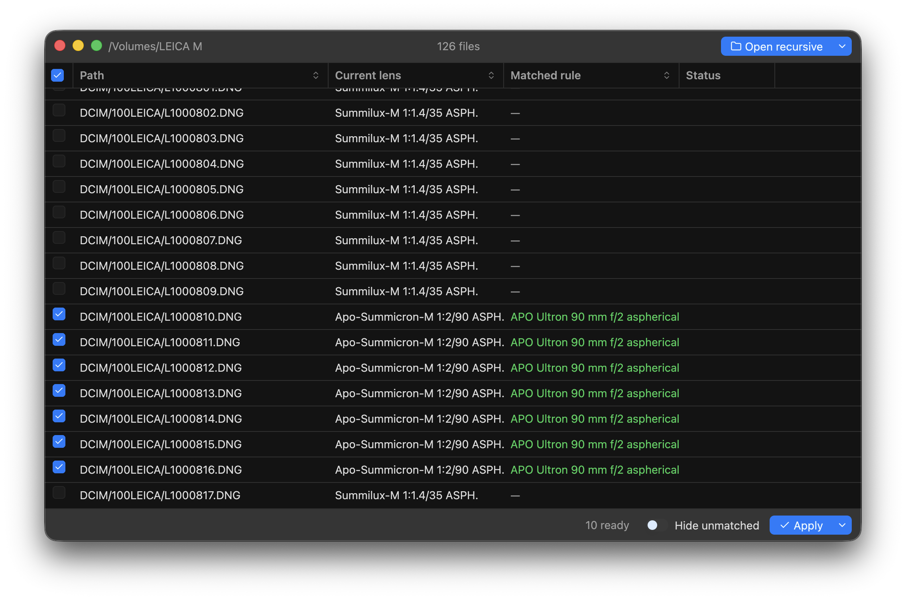

# Sixbiter

Sixbiter is a macOS application for viewing and correcting lens EXIF metadata in DNG RAW files. 



It is intended to let photographers who use third-party Leica M-mount lenses on digital Leica M-mount cameras set the lens EXIF to the correct lens when they either have those lenses [six-bit coded](https://lavidaleica.com/content/leica-lens-codes) or have set the lens in-camera as a related Leica lens.

The intended workflow is to first use Sixbiter to create rules for each of your lenses based on how it will appear in metadata out-of-camera. Then, before importing into your preferred library application (Lightroom, Capture One, etc):

- Open the SD card in Sixbiter, allow it to match lens metadata based on your rules
- Adjust rules as needed
- When the Current Lens to Matched Rules look correct to you, apply the changes.
- Import the photos into your library

Sixbiter is evolved from my command-line tool [sixbit-exif](https://github.com/willbarton/sixbit-exif).

## Features

- **Rule-based correction** — each rule specifies which EXIF fields to match, and what to replace them with. Rules will commonly target tags like `LensMake`, `LensModel`, `LensID`, `FocalLength`, but can apply to any other EXIF tag
- **Bulk apply** — select all matched files or pick individual ones
- **Backup on write** — by default, Sixbiter keeps a `filename.dng_original` copy alongside each modified file (this can be disabled). The backup is written once: if one already exists it is left alone, so re-applying after a rule change never overwrites your original metadata
- **Create rules from files** — right-click any unmatched file to create a rule pre-populated with its current lens EXIF fields

## Requirements

- macOS 11.0 or later

## Installation

There are no pre-built releases yet. Build from source:

```
git clone https://codeberg.org/willbarton/sixbiter.git
cd sixbiter
scripts/build-macos-bundle.sh
```

This produces `target/Sixbiter.app`. Copy it to `/Applications` or run it directly.

Building requires a Rust toolchain. Install one from [rustup.rs](https://rustup.rs) if you do not already have one.

## Usage

### Setting up rules

Open **Settings → Lens Rules** (⌘,) to manage your rules.

Each rule has:

- **Rule name** — a label for your own reference (e.g. "Voigtlander Ultron 35mm f/2")
- **When EXIF matches** — one or more field/value pairs that identify the in-camera/six-bit coded metadata
- **Change EXIF to** — the corrected field/value pairs to write

Add a rule manually, or open a folder first and right-click an unmatched file to generate a rule from its existing metadata.

### Correcting files

1. Open a folder with **File → Open Folder…** (⌘O). Use the dropdown arrow beside the button to enable recursive scanning of sub-folders.
2. Sixbiter scans the folder for DNG files and checks each one against your rules.
3. The table shows each file's current lens metadata and the rule that matched it, if any. Matched files are automatically checked.
4. Deselect any files you want to skip.
5. Click **Apply**. By default, Sixbiter creates a backup copy of each file before writing. To disable backups, use the dropdown beside the Apply button.

Use **Hide unmatched** to filter the view to only files with a pending correction.

Right-click any row for additional options: reveal the file in Finder, jump to the matched rule in Settings, or create a new rule from the file's metadata.

## License

Sixbiter is free software, released under the [GNU General Public License v3](LICENSE) or later.
